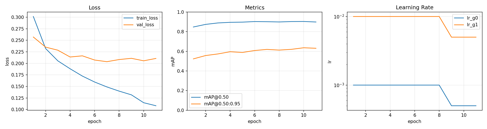
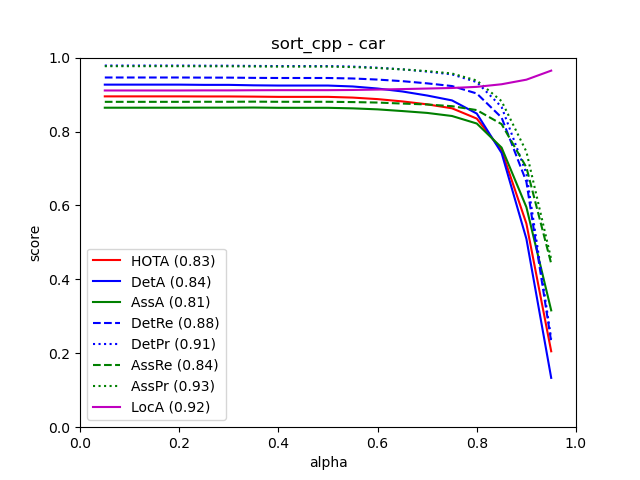
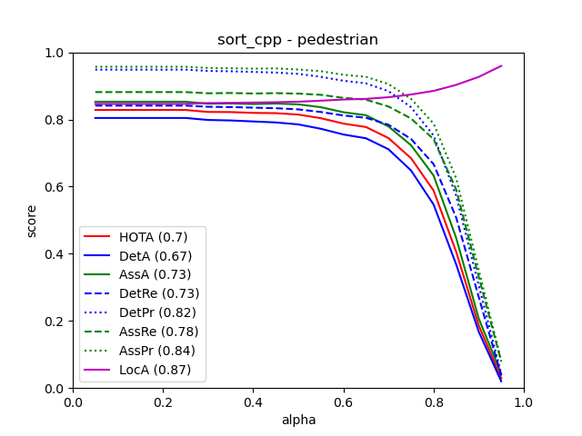

# Perception2D

KITTI-style 2D perception pipeline for object detection, C++ ONNX Runtime
inference, SORT-style tracking, visualization, CSV export, and evaluation
experiments.

This is a compact engineering project rather than a production-grade detector.
The detector is a Faster R-CNN baseline trained in Colab and exported to ONNX;
the main value of the project is the end-to-end path from training to C++
deployment and tracking evaluation. KITTI data, PyTorch checkpoints, ONNX
weights, and full runtime outputs are intentionally not committed.

## Demo

The preview below was generated from the C++ app output. It shows detection
boxes, track ids, and track tails. The MP4 files are the smaller source clips;
only one GIF is embedded to keep the repository landing page lightweight.


Additional clips:

- [Sequence 0002 (MP4)](result_examples/videos/demo_tracking_0002.mp4)
- [Sequence 0011 (MP4)](result_examples/videos/demo_tracking_0011.mp4)
- [Sequence 0013 (MP4)](result_examples/videos/demo_tracking_0013.mp4)

## What This Project Shows

- Faster R-CNN training workflow in `src_python/train.ipynb`
- ONNX export and ONNX Runtime consistency check in `tools_py/export_and_verify.py`
- C++17 inference app using OpenCV, ONNX Runtime, CLI11, and a class-aware
  SORT-style tracker
- Configurable image-directory inference with detection and tracking CSV output
- Visualization output for qualitative review
- Archived TrackEval output for a three-sequence KITTI tracking development
  subset

Known limitations are documented in [docs/model_card.md](docs/model_card.md).
The distinction between the custom training metric and the archived tracking
subset is documented in
[docs/evaluation_protocol.md](docs/evaluation_protocol.md).
The model can miss or misclassify small, distant, occluded, and underrepresented
objects; the videos should be read as a pipeline demo, not as evidence of
production-level perception accuracy.

## Evidence And Archived Results

Archived training curves from the original local run:



The plot's AP values come from the notebook's project-local validation
implementation. They are not official KITTI object-detection metrics because
the notebook does not implement KITTI difficulty levels, minimum object
heights, or `DontCare` handling.

Archived TrackEval screenshots:

| Car tracking | Pedestrian tracking |
| --- | --- |
|  |  |

Historical summary from `result_examples/TrackEval_results.md`:

| Split | HOTA | MOTA | IDF1 |
| --- | ---: | ---: | ---: |
| Car combined | 82.544 | 91.642 | 90.326 |
| Pedestrian combined | 69.723 | 77.394 | 85.963 |

These tables cover only training sequences 0011, 0012, and 0013. The exact
checkpoint digest, TrackEval revision, and conversion script from that older
run were not preserved, so the numbers are not reproducible from a clean clone
and must not be treated as official KITTI benchmark or leaderboard results.
See [the evaluation protocol](docs/evaluation_protocol.md) for the precise
evidence boundary.

## Quick Start

### Python Utilities

```bash
conda env create -f environment.yml
conda activate perception2d
```

### C++ Dependencies

Install or provide:

- CMake >= 3.20
- C++17 compiler
- OpenCV C++ libraries
- ONNX Runtime C++ package
- CLI11 headers

Recommended local layout:

```text
third_party/
  onnxruntime/
    include/onnxruntime_cxx_api.h
    lib/libonnxruntime.so
  cli11/
    include/CLI/CLI.hpp
```

You can also keep these dependencies elsewhere and pass their paths to CMake.

```bash
cmake -S . -B build \
  -DORT_ROOT=/path/to/onnxruntime \
  -DCLI11_ROOT=/path/to/CLI11
cmake --build build -j
```

## Data And Model Inputs

The app can process either a single image or a directory of images. A sequence
id is still required because it is used to name outputs and tracking records.

Recommended tracking layout:

```text
data/kitti_tracking/
  images/
    0011/
      000000.png
      000001.png
```

Model weights are expected outside the repo:

```text
weights/best_model.pth     # PyTorch checkpoint for export
models/best_model.onnx     # ONNX model consumed by the C++ app
```

Public defaults live in `configs/public/default.ini`. CLI flags override config
values. For the complete reproduction path, see
[docs/reproducibility.md](docs/reproducibility.md).

## Run

### 1. Export ONNX

```bash
python tools_py/export_and_verify.py \
  --weights-dir weights \
  --output-onnx models/best_model.onnx
```

For trusted checkpoints that require full pickle loading:

```bash
python tools_py/export_and_verify.py \
  --weights-dir weights \
  --output-onnx models/best_model.onnx \
  --allow-unsafe-load
```

### 2. Build The C++ App

```bash
cmake -S . -B build \
  -DORT_ROOT=/path/to/onnxruntime \
  -DCLI11_ROOT=/path/to/CLI11
cmake --build build -j
```

### 3. Run Detection And Tracking

```bash
./build/perception2d_app \
  --input data/kitti_tracking/images/0011 \
  --sequence 0011 \
  --model-path models/best_model.onnx \
  --output output/0011 \
  --score-threshold 0.8 \
  --max-frames 200
```

Expected output directory:

```text
output/0011/
  detections.csv
  tracks.csv
  vis/
    000000.png
    000001.png
```

## Example Output

Console summary:

```text
>>> Init Detector...
>>> Done. Frames: 373, Total detections: 3409, Avg infer: <machine-dependent> ms
>>> Outputs saved to: output/0011
```

`detections.csv`:

```csv
frame_id,image_name,class_id,score,x1,y1,x2,y2
0,000000.png,1,0.9996,879.5681,169.1960,1144.3434,343.8507
0,000000.png,1,0.9996,16.1623,175.9449,218.2804,262.5290
0,000000.png,3,0.9422,655.5082,170.2068,678.6063,211.2551
```

`tracks.csv`:

```csv
frame_id,image_name,track_id,class_id,score,x1,y1,x2,y2
2,000002.png,1,1,0.9992,925.6611,168.4754,1231.2559,370.6333
2,000002.png,2,1,0.9996,-2.5649,179.1877,193.3841,271.7750
3,000003.png,1,1,0.9993,958.8181,170.3886,1250.2634,371.6657
```

## Additional Utilities

Visualize simplified KITTI detection labels:

```bash
python tools_py/visualize_kitti.py \
  --data-root data/kitti_detection \
  --output-dir output/debug_vis \
  --num-samples 5 \
  --seed 42
```

Expected simplified layout for that utility:

```text
data/kitti_detection/
  images/000001.png
  labels/000001.txt
```

## Verification

```bash
uv run python -m unittest discover -s tests
```

The test suite validates the public config loader and repository contracts. It
does not require local datasets, weights, or third-party inference libraries.

## Repository Boundaries

- Training and inference reproduction requires external KITTI data and a
  locally trained checkpoint.
- The archived TrackEval subset cannot be reproduced from the committed files;
  see [docs/evaluation_protocol.md](docs/evaluation_protocol.md).
- `torch.load` can execute pickle payloads when unsafe loading is enabled. Use
  `--allow-unsafe-load` only for checkpoints you trust.
- Generated runtime artifacts are ignored by Git: `data/`, `weights/`,
  `models/`, `output/`, `build/`, and `third_party/`.
- The committed previews under `result_examples/gifs/` and
  `result_examples/videos/` are small README assets generated from local
  `output/` runs, not the full runtime outputs.

## License

MIT. See `LICENSE`.
